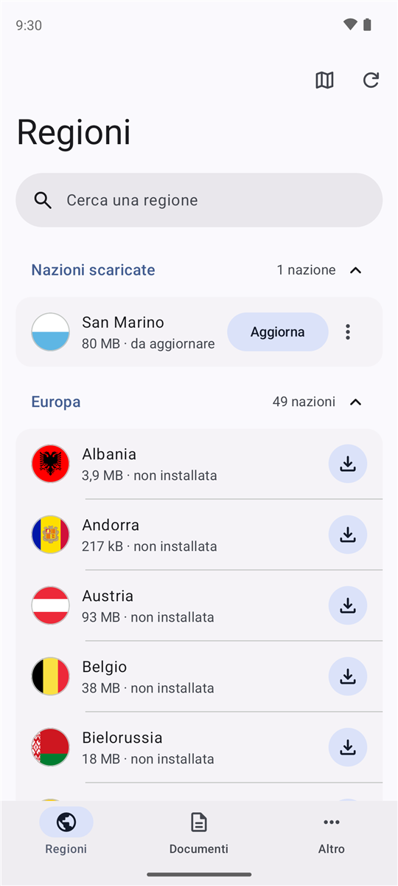
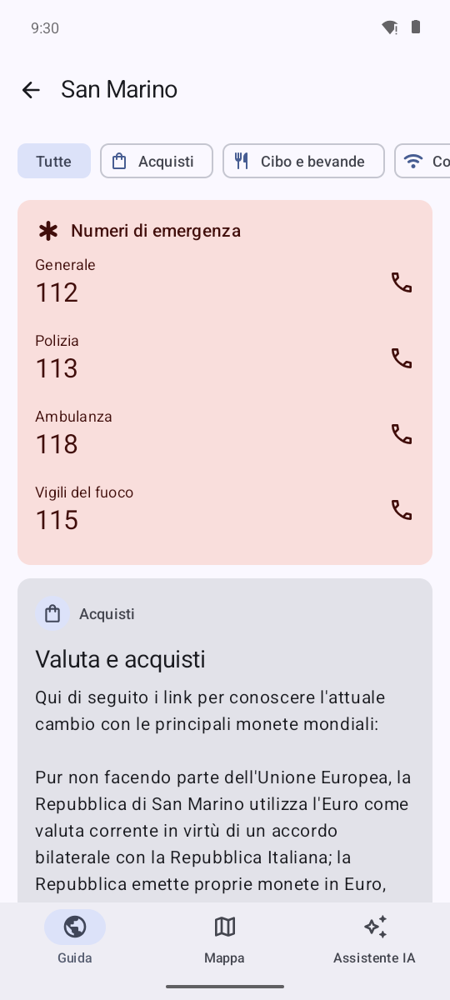
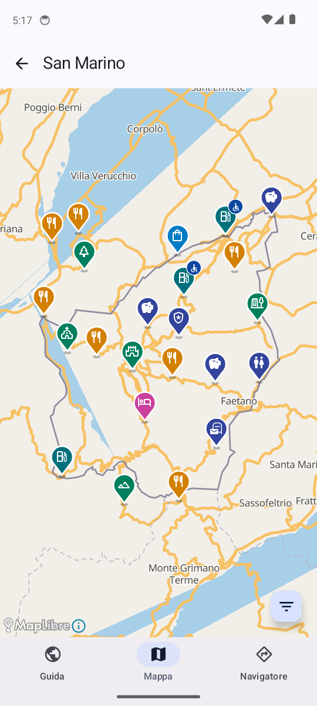
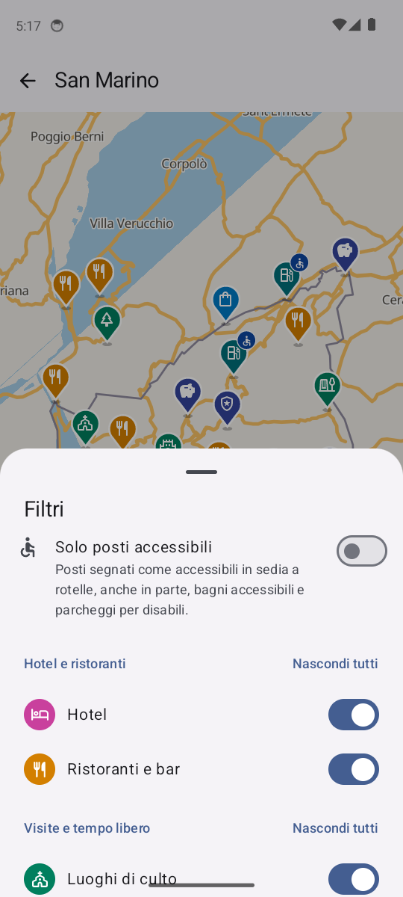
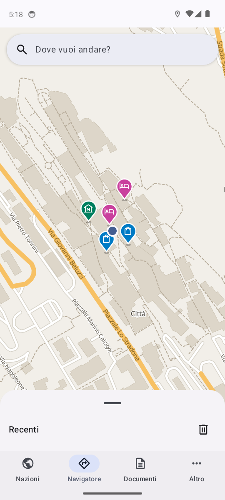
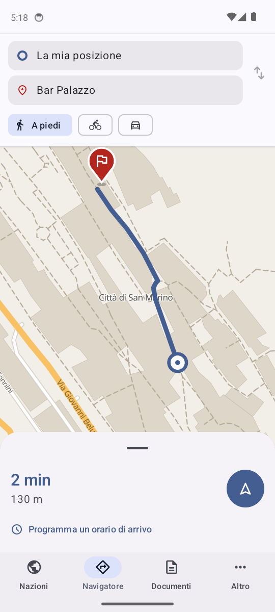
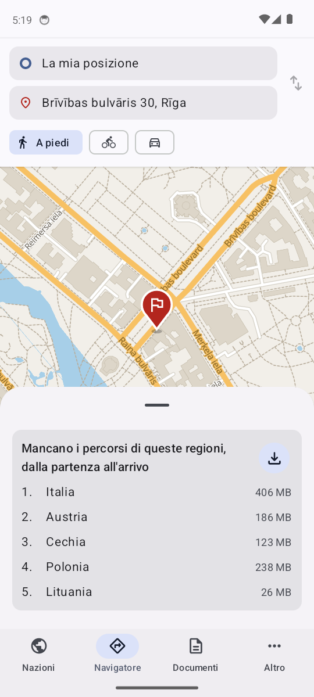
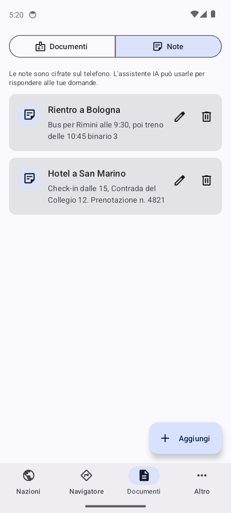
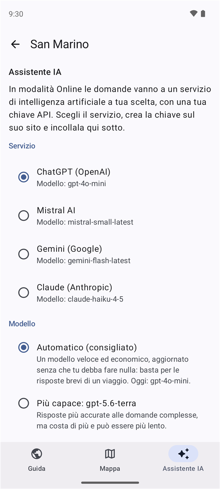
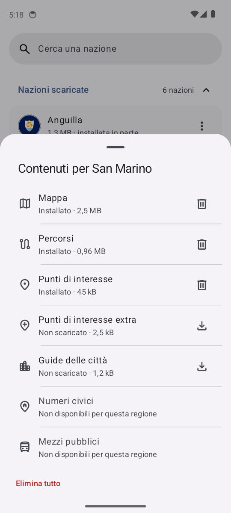

<p align="center">
  
</p>

<h1 align="center">Pocket Travel</h1>

<p align="center">
  Una bussola in tasca per ogni viaggio.<br>
  Guida, mappa, assistente IA e documenti, anche senza internet.
</p>

<p align="center">
  <a href="https://github.com/miracle091/pocket-travel/releases/tag/v0.9.0">Scarica l'app</a> ·
  <a href="CHANGELOG.md">Novità</a> ·
  versione <strong>0.9.0</strong>
</p>

<p align="center">
  
  
  
  
  
  
  
  
  
  
</p>

## Cosa fa

In viaggio la connessione manca spesso quando serve: in aereo, in montagna, all'estero senza roaming. Pocket Travel scarica prima i contenuti necessari e poi li usa offline.

- **Guida** – le informazioni essenziali di ogni paese e delle sue città (cosa vedere, dove mangiare, come muoversi, soldi, sicurezza; per le città anche storia e clima), i fatti rapidi (lingua, prese, fuso orario, valuta, trasporti), i numeri di emergenza da chiamare con un tocco e le ambasciate e i consolati del paese di cui si ha la nazionalità (da OpenStreetMap e Wikidata), con in cima quelli vicini alla posizione. In cima c'è il meteo, con le previsioni di 7 giorni: di dove ti trovi se sei nel paese, altrimenti della capitale, e ogni città ha il suo; senza rete resta l'ultimo scaricato, e "Aggiorna" lo richiede al massimo ogni 10 minuti. Il riquadro delle città mostra le cinque più popolose, con una stella sulla capitale, e ognuna apre subito la propria guida. I riquadri della guida hanno intestazioni e descrizioni uniformi.
- **Vaccinazioni** – una scheda nella guida del paese di destinazione apre una schermata con le vaccinazioni per il viaggio: si indicano il paese di partenza, gli eventuali scali, i paesi visitati prima, l'età di un bambino sotto un anno e l'eventuale Hajj o Umrah. Il risultato divide le vaccinazioni in obbligatorie, raccomandate e da valutare con il medico. Il calcolo è offline, con dati curati da [Travel.gc.ca](https://travel.gc.ca) (Open Government Licence - Canada 2.0) e [TravelHealthPro](https://travelhealthpro.org.uk) (Open Government Licence v3.0); i collegamenti alle fonti sono divisi tra italiano e inglese e un avviso ricorda di verificare sempre con ambasciata e fonti ufficiali. L'assistente IA riceve l'esito nel contesto quando la domanda riguarda i vaccini.
- **Mappa** – mappa dettagliata con ristoranti, hotel, farmacie, bancomat e molto altro, con orari, indirizzo e contatti quando disponibili. Si scelgono uno o più modi di spostarsi (a piedi, in bici, in auto, con i mezzi pubblici...) e l'app mostra i punti utili per tutti; i filtri sono divisi in gruppi, ognuno con un'icona per mostrarne o nasconderne tutte le categorie.
- **Navigatore** – è nella barra principale e nella pagina di ogni regione. Si cerca la meta per nome o per indirizzo ("Via Roma 12") in tutte le nazioni scaricate, si vedono percorso, tempo e svolte e si parte. La navigazione passo passo resta nella schermata, continua a schermo spento con una notifica fissa e si vede anche sopra la schermata di blocco. Si può indicare l'ora di arrivo e ricevere un avviso sull'ora di partenza.
- **Mezzi pubblici** – nella scheda di una fermata, di una stazione o di un porto sono mostrate le prossime partenze delle tre ore successive, offline, per le reti con dati aperti (per ora in Lettonia, Italia, Svezia, Spagna, Francia, Svizzera e Regno Unito). Dove una nazione ha molte reti si sceglie quali scaricare; di default sono quelle vicine alla posizione.
- **Assistente IA** – risponde alle domande sulla nazione o sulla città in cui ci si trova ("dove si mangia bene?", "come pago il bus?") in poche frasi, basandosi sulla guida scaricata e sulle note di viaggio, e indica quando la guida non basta. Funziona anche senza internet (vedi [più sotto](#assistente-ia)). "Portami al Colosseo a piedi" apre il Navigatore con la meta già cercata.
- **Fonti ufficiali** – i siti del ministero degli esteri del paese di cui si ha la nazionalità e quelli internazionali (OMS, CDC), per controllare documenti, sicurezza e salute prima di partire.
- **Documenti** – una copia del passaporto, dei biglietti e di altri documenti, cifrata e sbloccabile solo con l'impronta o il volto; per i biglietti l'app suggerisce compagnie aeree e aeroporti anche senza internet. Accanto, con il selettore Documenti | Note, le note di viaggio (prenotazioni, indirizzi), cifrate e usate dall'assistente IA quando servono.

L'app è in **italiano e in inglese**: interfaccia, guide delle nazioni e delle città e assistente IA. La lingua si sceglie al primo avvio e si cambia in **Altro → Impostazioni**, insieme a nazionalità, aspetto, modi di spostarsi, opzioni del Navigatore e assistente IA.

Le nazioni da scaricare si scelgono anche già al primo avvio, in tre passi insieme a lingua, modi di spostarsi e nazionalità: per ogni nazione mappa, punti di interesse, numeri civici, rete stradale e orari dei mezzi pubblici sono contenuti separati, così non si occupa spazio per ciò che non serve. La mappa è leggera di default, meno dettagliata e circa il 40% più piccola, e si può avere dettagliata dai Contenuti della nazione. Nei Contenuti si sceglie anche per quali mezzi è la rete stradale: solo per l'auto (circa il 40% di spazio in meno), oppure per bici e piedi o per tutti i mezzi (la rete completa). Le guide di tutto il mondo pesano pochi megabyte. Con la rete stradale il Navigatore guida fino a un punto della mappa o a un indirizzo, svolta dopo svolta, con il GPS acceso, anche da una nazione all'altra se è scaricata la rete stradale delle nazioni lungo la strada (se manca, il Navigatore indica quali nazioni mancano e scarica la loro rete insieme). Autovelox, limiti di velocità e zone a traffico limitato o a basse emissioni non sono segnalati.

Ci sono 355 regioni (le nazioni più grandi, come Stati Uniti, Canada e Cina, sono divise in più regioni), aggiornate ogni settimana.

## Assistente IA

L'assistente cerca nella guida del paese, in quelle delle sue città e nelle note di viaggio, e risponde solo con ciò che trova, in massimo tre frasi. Quando la guida non contiene la risposta, lo indica; per dogane e salute aggiunge il collegamento alla fonte ufficiale. Alla domanda sulla distanza tra due città del paese ("Quanti km ci sono tra Torino e Milano?") sul telefono risponde con la distanza in linea d'aria e, se è scaricata la rete stradale, con la lunghezza e il tempo del percorso in auto, calcolati come nel Navigatore. Ha due motori, da scegliere in **Altro → Impostazioni → Assistente IA**. La scheda **IA** di ogni nazione compare quando l'assistente è pronto, cioè con un modello scaricato o una chiave API salvata.

### Sul dispositivo (offline)

Un piccolo modello di intelligenza artificiale gira direttamente sul telefono: nessuna connessione, nessun dato che esce dal telefono. Serve un telefono con almeno 4 GB di RAM; l'app propone il modello adatto alla sua memoria.

| RAM del telefono | Addestrato da noi (proposto in italiano) | Ufficiale (proposto in inglese) |
|---|---|---|
| 4 GB | [Pocket Travel 0.8B (Qwen3.5)](tools/data-pipeline/model-cards/qwen3.5-0.8b-travel-it-GGUF.md) – 0,53 GB | [Qwen3.5 0.8B](https://huggingface.co/unsloth/Qwen3.5-0.8B-GGUF) – 0,56 GB |
| 8 GB | [Pocket Travel 2B (Qwen3.5)](tools/data-pipeline/model-cards/qwen3.5-2b-travel-it-GGUF.md) – 1,27 GB | [Qwen3.5 2B](https://huggingface.co/unsloth/Qwen3.5-2B-GGUF) – 1,34 GB |
| 12 GB o più | [Pocket Travel 4B (Qwen3)](tools/data-pipeline/model-cards/qwen3-4b-instruct-2507-travel-it-GGUF.md) – 2,50 GB | [Qwen3 4B Instruct 2507](https://huggingface.co/unsloth/Qwen3-4B-Instruct-2507-GGUF) – 2,55 GB |

I modelli "Pocket Travel" sono addestrati da noi sulle guide di viaggio e rispondono in italiano: ogni nome porta alla sua scheda nel repository (come è stato addestrato, risultati, licenza), pubblicata anche su [huggingface.co/pockettravel](https://huggingface.co/pockettravel). Gli "Ufficiali" sono gli stessi modelli Qwen come li pubblicano i loro autori (qui nella versione quantizzata di Unsloth). Un telefono vede anche i modelli delle fasce più basse. Con l'app in inglese la lista mostra solo i modelli che rispondono in inglese: per ora quelli "Ufficiali", in attesa dei nostri modelli in inglese.

Per iniziare: in **Impostazioni → Assistente IA** scegli **Sul dispositivo**, tocca il modello e poi **Scarica modello** (meglio col Wi-Fi). Nella scheda **IA** la risposta compare mentre il modello la scrive; dal menu ⋮ si elimina il modello. Quando un modello viene migliorato, l'app lo segnala con una notifica e lo riscarica anche senza un aggiornamento dell'app.

### Online (con la tua chiave API)

Se il telefono ha poca memoria, o vuoi un modello più grande, l'assistente può usare un servizio di intelligenza artificiale a tua scelta, con una tua chiave API personale. Con il motore Online la domanda va al servizio **così com'è, senza la guida scaricata**: le risposte sono più generali, e per dogane e salute conviene sempre controllare la fonte ufficiale.

La chiave resta solo sul telefono, cifrata, e le domande vanno direttamente da te al servizio: non passano da nessun server nostro. L'uso lo paghi tu, sul tuo account del servizio (alcuni hanno una quota gratuita). Una chiave API è come una password: non condividerla, e dove il servizio lo permette imposta un limite di spesa.

| Servizio | Automatico (oggi) | Più capace | Dove si crea la chiave | Com'è fatta la chiave |
|---|---|---|---|---|
| ChatGPT (OpenAI) | `gpt-4o-mini` | `gpt-5.6-terra` | [platform.openai.com/api-keys](https://platform.openai.com/api-keys) | inizia con `sk-` |
| Mistral AI | `mistral-small-latest` | `mistral-large-latest` | [console.mistral.ai/api-keys](https://console.mistral.ai/api-keys) | lettere e cifre, senza un prefisso fisso |
| Gemini (Google) | `gemini-flash-latest` | `gemini-2.5-pro` | [aistudio.google.com/apikey](https://aistudio.google.com/apikey) | inizia con `AIza` |
| Claude (Anthropic) | `claude-haiku-4-5` | `claude-sonnet-4-6` | [console.anthropic.com/settings/keys](https://console.anthropic.com/settings/keys) | inizia con `sk-ant-` |

In tutti i casi, nell'app: in **Impostazioni → Assistente IA** scegli **Online**, scegli il **Servizio**, incolla la chiave in **Chiave API** (l'icona a forma di occhio la mostra, per controllarla) e tocca **Salva chiave**. Il pulsante **Crea la chiave su …** apre direttamente la pagina giusta del servizio scelto. Cambiando servizio la chiave salvata si cancella, perché è valida solo per il suo servizio. Per toglierla: **Rimuovi chiave** nelle Impostazioni, o menu ⋮ → **Rimuovi chiave** nella scheda IA. Se il servizio rifiuta la chiave (scaduta o revocata) l'assistente lo dice e propone di toglierla.

**Esempio con ChatGPT.** Su [platform.openai.com](https://platform.openai.com) crea un account e aggiungi del credito in **Billing**; in **API keys** tocca **Create new secret key** e copia la chiave (OpenAI la mostra una volta sola: qualcosa come `sk-proj-AbCd…`). Nell'app scegli **ChatGPT (OpenAI)** e incollala.

**Esempio con Mistral AI.** Su [console.mistral.ai](https://console.mistral.ai) accedi, scegli un piano (c'è anche quello gratuito per provare) e in **API keys** crea una nuova chiave. Nell'app scegli **Mistral AI** e incollala. Una chiave appena creata può impiegare qualche minuto prima di funzionare.

**Esempio con Gemini.** Su [aistudio.google.com](https://aistudio.google.com) accedi con un account Google e tocca **Get API key** → **Create API key**: la chiave (`AIza…`) si copia subito. Nell'app scegli **Gemini (Google)** e incollala. Il piano gratuito di Gemini ha limiti di richieste al minuto e al giorno.

**Esempio con Claude.** Su [console.anthropic.com](https://console.anthropic.com) crea un account e aggiungi del credito in **Billing**; in **API keys** tocca **Create Key** e copia la chiave (`sk-ant-…`, mostrata una volta sola). Nell'app scegli **Claude (Anthropic)** e incollala.

Poi fai una domanda, per esempio "Serve il visto per entrare?" o "Come si paga il bus in città?". Le chiavi negli esempi sono finte: la tua sarà diversa. Tutti e quattro si usano con la stessa interfaccia, compatibile con quella di OpenAI.

**Il modello.** Sotto **Modello** ci sono tre scelte, ricordate per ciascun servizio:

- **Automatico (consigliato)**: un modello veloce ed economico, che basta per le risposte brevi di un viaggio. Per Mistral e Gemini è un nome che il servizio stesso aggiorna al modello più recente (`mistral-small-latest`, `gemini-flash-latest`); per ChatGPT e Claude, che non ne hanno uno, è quello indicato in tabella, aggiornato con le nuove versioni dell'app.
- **Più capace**: risposte più accurate alle domande complesse, ma costa di più e può essere più lento.
- **Altro modello**: scrivi a mano il nome esatto di un altro modello del servizio (per esempio `gpt-4.1` o `gemini-2.5-flash-lite`). Se il servizio non lo conosce, l'assistente lo dice; svuotando il campo si torna all'automatico.

Il modello in uso si legge sotto il nome di ogni servizio ("Modello: …").

## Da dove vengono i dati

Tutto viene da progetti aperti e liberi: le guide da [Wikivoyage](https://it.wikivoyage.org) (in italiano e, per l'app in inglese, in [inglese](https://en.wikivoyage.org)) e [Wikipedia](https://it.wikipedia.org), le mappe e i punti di interesse da [OpenStreetMap](https://www.openstreetmap.org) (le mappe nel formato di [Protomaps](https://protomaps.com)), i numeri civici da OpenStreetMap e dai registri ufficiali degli indirizzi raccolti da [Overture Maps](https://overturemaps.org), il calcolo dei percorsi da [BRouter](https://brouter.de), le ambasciate e i consolati anche da [Wikidata](https://www.wikidata.org), la popolazione, la capitale e le coordinate delle città da Wikivoyage e Wikidata, la storia e il clima delle città da Wikipedia, le vaccinazioni da Travel.gc.ca e TravelHealthPro, i consigli di viaggio delle guide in inglese (sicurezza, leggi e cultura, catastrofi naturali e clima, salute) da Travel.gc.ca e, per Palestina, Pitcairn e Wallis e Futuna, dalle schede di viaggio del Governo britannico (gov.uk), il meteo da [Open-Meteo](https://open-meteo.com) (CC BY 4.0, senza chiave né account). L'app non ha un server proprio e non raccoglie dati sugli utenti. La posizione, richiesta solo per il Navigatore, resta sul telefono e si usa solo lì: per la guida (anche a schermo spento, sempre con una notifica fissa che lo mostra), per i percorsi che partono da dove sei e, con il Navigatore aperto senza meta, per mostrarti i posti vicini; per il meteo "Vicino a te" a Open-Meteo arriva solo la zona, arrotondata a circa 10 km. La chiave dell'assistente IA online, se la usi, resta solo sul telefono. Il catalogo dei dati è firmato: l'app controlla la firma con una chiave pubblica incorporata e rifiuta i file non firmati.

## Per chi sviluppa

Per iniziare c'è una [guida rapida](docs/GUIDA.md); il perché delle scelte tecniche è spiegato nella [wiki](https://github.com/miracle091/pocket-travel/wiki).

L'app è scritta in Kotlin con Jetpack Compose. Il codice è diviso in moduli:

| Cartella | Cosa contiene |
|---|---|
| `app/` | schermate principali (Nazioni, Navigatore, Altro, Impostazioni) e navigazione tra le schermate |
| `core/` | database, download e installazione dei pacchetti, tema grafico, categorie dei punti di interesse |
| `feature/` | guida, mappa e Navigatore, assistente IA, documenti e note, fonti ufficiali (ognuna dipende solo da `core`) |
| `tools/data-pipeline/` | gli script che preparano e pubblicano a turno, ogni notte, guide, mappe, punti di interesse e numeri civici, e quelli per generare i dataset e addestrare i modelli dell'assistente IA |
| `tools/dev/` | strumenti per lo sviluppo, come la simulazione del GPS lungo un percorso sull'emulatore |
| `third-party/` | copie di BRouter e llama.cpp usate dall'app |
| `build-logic/` | configurazione Gradle comune ai moduli Android (SDK, Java, Compose, Hilt, detekt) |

Per aprire il progetto serve Android Studio con JDK 17 o successivo: basta aprire la cartella (Gradle è già incluso).

Per provare l'app con un catalogo di dati proprio invece di quello pubblicato (solo nelle build di debug):

```bash
./gradlew :app:installDebug -PpocketTravel.manifestUrl=http://10.0.2.2:8000/manifest.json
```

`10.0.2.2` è il computer di sviluppo visto dall'emulatore. Con un catalogo proprio l'app non controlla le firme (vedi sotto).

Per provare la navigazione del Navigatore senza muoversi: in una build di debug si apre il Navigatore, si sceglie la meta, si tocca Avvia e si lancia `node tools/dev/simulate-route.js 12`. Lo script legge il percorso dal log dell'app e muove il GPS dell'emulatore lungo il percorso, a 12 m/s (il numero è la velocità).

Per pubblicare i dati da un fork: i file JSON che l'app scarica (`manifest.json`, `transit.json`, `address-grid.json`, `app-status.json`) sono firmati con ECDSA P-256 nei workflow, con la chiave privata del secret `MANIFEST_SIGNING_KEY`; senza il secret i workflow si fermano invece di pubblicare file non firmati. Il catalogo di un fork si sceglie anche senza ricompilare l'app, da **Altro → Impostazioni → Catalogo**, con l'indirizzo di `manifest.json` e la chiave pubblica. Come creare la chiave e incorporare la chiave pubblica nell'app è spiegato in [tools/data-pipeline/README.md](tools/data-pipeline/README.md). L'ordine conta: prima una pubblicazione delle regioni con le firme (`publish-regions.yml`), poi la versione dell'app che le richiede, altrimenti l'app rifiuta il catalogo. I numeri civici stanno su 12 release (`address-cells-0` … `address-cells-11`), per restare sotto il limite di 1000 file per release di GitHub.

## Licenza

Il codice è sotto licenza [MIT](LICENSE). I dati hanno le loro licenze ([CC BY-SA 4.0](https://creativecommons.org/licenses/by-sa/4.0/deed.it) per Wikivoyage e Wikipedia, [ODbL 1.0](https://opendatacommons.org/licenses/odbl/1-0/) per OpenStreetMap, [CC0](https://creativecommons.org/publicdomain/zero/1.0/deed.it) per Wikidata, Open Government Licence per i dati vaccinali e i consigli di viaggio di Travel.gc.ca (Canada 2.0) e per i dati vaccinali di TravelHealthPro e i consigli di viaggio di gov.uk (v3.0); i civici di Overture Maps hanno la licenza del registro da cui vengono): l'elenco completo, con tutte le fonti dei civici, è nella schermata Licenze dell'app.
